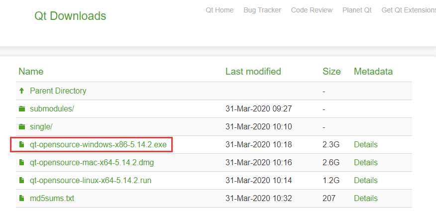

<!--
author: BRabbitFan
date: 2021-05-24
title: Qt开发库简介与环境配置
tags: Qt,学习笔记
category: Qt学习笔记
status: publish
summary: 本文简单介绍Qt，包括安装配置以及基本的测试，不涉及其本身的理论知识。
-->

## 前言

这是我本人在Qt学习阶段所记录的笔记，留作日后自己翻阅。编写的过程也伴随着我学习的过程，因此内容中将不可避免的出现些许描述不恰当之处甚至谬误。总之可以作为参考酌情阅读。

完整文档均可下载，详见：https://github.com/BRabbitFan/NoteQt

## Qt简介

Qt是一个跨平台的C++开发库，很适合用于开发GUI程序。但其除了GUI库之外，同时也为用户提供了数据库、图像处理、音视频处理、网络通信、文件操作甚至并发操作等相关API，这为客户端界面的开发提供了极大的便利。

> 在我开始学习Qt之前，主要的学习方向是服务器端与Web后端相关知识。相比于使用Qt进行开发工作，这二者通常都需要使用到各种各样的框架、工具进行协同开发。即便最普通的一个网游服务器端程序，也需要至少同时运用到一个框架+MySQL+Redis。  
> 但使用Qt进行客户端程序开发时，几乎所有需要的工具其均有内置的可选项，相比之下可以说是非常方便了。

<!-- 

 -->

### Qt与MFC
Qt最早是Linux平台的开发库，但其渐渐也支持Windows、Andriod等各个平台。至少在跨平台这方面上Qt相比MFC更强。同时在新手学习的阶段，Qt也比MFC更容易入门。在Windows平台中二者均是通过封装Windows API实现的功能，但Qt向用户屏蔽了更多底层细节，至少在初学阶段是无需考虑那些恼人的Windows API了。

## 开发工具

Qt本身只是一个开发库，因此所谓开发Qt程序无非是在各种IDE中调用该库。通常情况下使用最多有这么几种方案：  

- **Qt Creator + Qt**   
Qt Creator是Qt官方所提供专为Qt定制的IDE。集成了Qt Designer等方便的开发工具，同时也提供了大量的案例工程与完整的帮助手册。通常情况下即便不适用QtCreator作为IDE进行开发，也会使用到其内置的Qt Designer与帮助手册进行辅助开发。
- **Visual Studio + Qt**  
~~作为宇宙最强的IDE,~~ VS也支持开发Qt程序，其中需要用到VS的扩展"Qt VS Tools"。得益于VS本身强大的功能，这个方案也是相当部分团队的选择。
- **VS Code + Qt**  
VS Code也支持通过对扩展进行配置进行Qt程序的开发。但使用该方案自然也伴随着VS Code自身的优缺点：开发时方便好用但总有各种各样奇怪又麻烦的配置问题。

这里我采用VS + Qt的方案，准确地说是VS2019 + Qt 5.14.2。

## 配置Visual Studio + Qt开发环境

### 安装配置Qt 5.14.2

总的来说分为下面几步：

1. 下载安装程序
2. 安装Qt
3. 配置环境变量

在[Qt官网的下载界面](https://download.qt.io/archive/qt/)选择版本5.14.2点击下载。 

 
在Qt安装过程中需要登陆账号，根据提示去注册一个登录就好，后续开发不再需要注册登录。

安装过程按照需要勾选 **"MSVC 2017 32-bit"** 或 **"MSVC 2017 64-bit"** 组件（或者直接都选）。这里选择的是VS2017，但不影响Qt与VS2019协同工作。  

其他部分按照正常流程下一步即可。  

安装完成后，在 **"安装目录\Qt5.14.2\5.14.2"** 目录下可见刚才所选组件的目录，将其下的bin目录添加入环境变量中。  

### 安装配置VS2019

总的来说分为下面几步：

1. 下载安装程序
2. 安装VS
3. 安装Qt扩展插件
4. 配置Qt扩展插件

首先在[微软官网的VS下载界面](https://visualstudio.microsoft.com/zh-hans/vs/)下载VS2019。  

安装过程需要勾选 **"使用C++的桌面开发"** 组件。其他部分按照正常安装流程下一步即可。  
0_VS安装_1.png

安装完成后启动VS，选择 **"继续但无需代码"** 。在 **"扩展->管理扩展"** 内搜索并下载扩展 **"Qt VS Tools"** 。

扩展安装完毕后，进入 **"扩展->Qt VS Tools->Qt Versions"** 添加一个Qt版本。其中Version是自定义的名字，Path选择先前安装好的Qt组件目录内bin目录下的qmake.exe文件。  

## 验证测试开发环境

环境搭建完成后，启动VS。选择 **"创建新项目"** 新建一个 **Qt Widgets Appliaction** 工程。若选项里没有该工程，也可以在搜索框里搜到。  

创建VS工程完成后，会自动打开Qt VS Tools的创建工程界面，这里不做设置直接下一步直到创建完成。  

创建完成后，可见资源管理器中有如下目录与文件：  

此处不详细介绍个文件的作用，直接运行工程，将显示一个空白的窗口。  

至此，环境配置测试成功！

## 相关工具介绍

### Qt Designer

在上面的测试工程中，双击资源管理器中的.ui文件，Qt VS Tools将自动使用Qt Designer将其打开。该工具可以通过可视化界面方便地设计Qt界面布局。大致界面如下：  

有可能会出现打开.ui文件失败，这是因为默认使用Qt VS Tools自带的Qt Designer版本打开，该版本可能与当前工程的版本有冲突。解决方法就是使用创建当前工程的Qt组件所携带的Qt Designer版本。  

右击.ui文件，在打开方式中添加新的打开方式。程序是Qt组件目录下bin目录中的designer.exe程序。记得将其设置为默认值。此后再双击.ui文件即可成功。

### Qt Creater 中的帮助文档

安装Qt时将自动安装Qt Creater，可在Windows搜索中找到。在 **"帮助->目录"** 或 **"帮助->索引"** 中可以查阅所安装Qt版本完整的帮助文档，这在学习或实际开发中很有用。  

### Qt Creater自带的示例工程

Qt Creater自带了一些示例工程，可以直接在Qt Creater中运行，在学习过程中有一定的帮助。打开Qt Creater后即可见到。  
