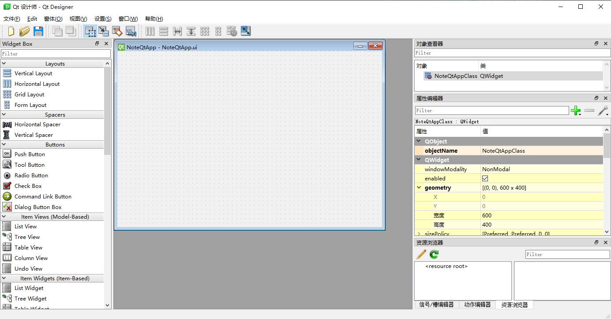

<!--
author: BRabbitFan
date: 2021-05-25
title: Qt的基本开发步骤与特性机制
tags: Qt,学习笔记
category: Qt学习笔记
status: publish
summary: 本文将对Qt程序的基本开发步骤与Qt特性中的机制进行基本的介绍,这将辅助以一个示例程序来讲述.
-->

<div id="Qt工程的基本配置"></div>

## Qt工程的基本配置

### 工程模板

使用VS2019新建一个Qt工程, 可选的项目模板有如下几项:


其中较为常见的有如下几项:

- **Qt Console Application**  
这是一个不带GUI界面的Qt工程, 你可以如同最常见的C++程序一样让其在终端中输入/输出.  
这个工程通常用于学习与测试.

- **Qt Quick Application**  
Qt Quick是Qt引入的一个概念, 其使用一种叫做QML的语言进行GUI的布局设计.  
QML使用起来有点像写前端代码一样. 日后学习到该部分再做详细介绍.

- **Qt Widgets Application**  
最常见的工程模板, 通过控件进行GUI布局设计, 通过信号与槽机制建立对象的通信.  
本文与后续的大多数文章将以该类工程为例进行介绍.

此处建立一个 **Qt Widgets Application** 模板的工程, 工程名为 "NoteQtApp".

### Base class

当VS创建Qt工程结束后，会调用Qt VS Tools的Qt工程创建界面。其中有一个特殊的 **Base class** 选项，这将是该工程主类所继承的基类。Base class一共有如下几种：

- **QWidget**  
QWidget类是所有用户界面对象的基类, 也是实际使用中最常见的窗口类型. 它只有一个空白的窗口界面, 并在该界面中接收系统的鼠标点击/键盘输入等事件.

- **QMainWindow**  
QMainWindow顾名思义即“主窗口”，它拥有自己的布局，包括中央区域、菜单栏、工具栏等。其有点像于一个界面布局的“半成品”。

- **QDialog**  
QDialog类是对话框窗口的基类, 所谓对话框窗口即用于进行短期的任务而存在的. 如"消息提示窗", "目录选择窗口"等等.  

虽然三者看似负责不同的工作, 但实际使用上你可以使用任意一种完成其余二者的工作.   
具体而言就是 : 一切根据业务需求走.

此处建立一个继承 **QWidget** 基类的主类, 主类的名字与工程名相同即 "NoteQtApp".

<div id="Qt程序与C++程序"></div>

## Qt程序与C++程序

Qt程序本质也是一个C++程序, 只是运用了Qt提供的相关工具. 当工程创建完成后, 打开工程的 **main.cpp** 文件, 可见其内容如下: 

```cpp
#include "NoteQtApp.h"
#include <QtWidgets/QApplication>

int main(int argc, char *argv[]) {
  QApplication a(argc, argv);
  NoteQtApp w;
  w.show();
  return a.exec();
}
```

其中可见 **QApplication** 对象 与 **NoteQtApp** 对象.  

**QApplication** 对象是每个Qt程序必须有且仅有一个的实例, 它本身是单例的. 其主要工作是这几件事:  
1. 负责该Qt程序的初始化/收尾工作.
2. 接受系统的各类事件, 并发送给需要的窗口.
3. 管理窗口在系统中的各类信息, 如当前所在位置等.

总而言之, **QApplication** 用于辅助Qt程序的具体功能实现.

**NoteQtApp** 对象是通过以上几个步骤设置自动创建的. 打开 **NoteQtApp.h** 文件可见其内容如下:  

```cpp
#pragma once

#include <QtWidgets/QWidget>
#include "ui_NoteQtApp.h"

class NoteQtApp : public QWidget {
  Q_OBJECT

public:
  NoteQtApp(QWidget *parent = Q_NULLPTR);

private:
  Ui::NoteQtAppClass ui;
};
```

由此可见, 其与常见的C++类没有太大区别. 实际上我们也可以自己实现一个继承自 **QWidget** 基类的子类并创建对象, 通过调用其show()方法使这个窗口显示出来.

<div id="Qt程序基本开发步骤"></div>

## Qt程序基本开发步骤 

若以Web开发的思维来看一个带有GUI界面的客户端程序, 则该程序需要考虑方面可以简化为两点: 

1. 实现窗口界面的布局
2. 在此基础上实现具体的业务逻辑

具体到Qt而言就是:

1. 设计GUI布局
2. 建立对象间的通信

实际上Qt也有着一个复杂的架构, 是为InterView. 该架构有点类似于MVC但也有所不同. 此处只考虑简单的Qt程序, 不对其做过多介绍.

<div id="设计GUI布局"></div>

## 设计GUI布局

在Qt中实现GUI的设计有两种方式:

1. 使用代码生成控件
2. 使用Qt Designer 布局管理器 生成控件

在实际开发中两种方式都有运用, 前者适合设计一些复杂的布局, 后者在界面不太复杂的时候可以节省时间.

### 使用代码生成控件

Qt中每一种控件都封装为一个C++类, 其大多数继承自 **QWidget** 基类.  
Widget之间可以设置上下级关系, 子Widget将默认显示在父Widget内.  

因此, 想要生成并显示一个控件的方法就是 构造一个控件Widget的实例 并 将该实例设置为一个可显示的Widget的子Widget.   

**QLabel** 是一个文本框控件, 其负责展示文本信息并且不可编辑. 以下代码在窗口中加入了一个 
**QLabel** 控件.

```cpp
#include "NoteQtApp.h"

#include <QLabel>

NoteQtApp::NoteQtApp(QWidget *parent) : QWidget(parent) {
  ui.setupUi(this);

  this->setFixedSize(300, 150);              // 设置窗口尺寸

  QLabel *countLabel = new QLabel(this);     // 构造QLabel对象
  countLabel->setGeometry(50, 10, 100, 20);  // 设置坐标
  countLabel->setText("0");                  // 设置文本内容

}
```

编译执行后显示的窗口如下:


### 使用 Qt Designer 布局管理器 生成控件

Qt Designer可以用于设计布局, 其通过可视化的方式, 用户只需要使用鼠标拖拽即可将控件加入窗口中.

Qt Designer的界面如下:



**QPushButton** 是按钮控件, 其在Qt Designer中位于左侧Buttons的Push Button选项. 

下面拖拽两个 Push Button 至中间的窗口, 并在右侧设置属性:

- objectName : 控件的名字 对应 代码中实例的变量名, 设置为plusBtn与minusBtn
- text : 按钮上显示的文本, 设置为plus与minus

保存后编译运行可见界面如下:


可见, 之前代码生成的控件与现在在Qt Designer中拖拽的控件都显示出来了.

### Qt中的ui指针

在Qt Designer中打开 "窗体" -> "View C++ Code" 可见到当前拖拽的布局控件在底层的具体实现代码.  

以下是核心代码:

```cpp
class Ui_NoteQtAppClass {
public:
  QPushButton *plusBtn;
  QPushButton *minusBtn;

  void setupUi(QWidget *NoteQtAppClass) {  // 注意此处
    if (NoteQtAppClass->objectName().isEmpty())
      NoteQtAppClass->setObjectName(QString::fromUtf8("NoteQtAppClass"));
    NoteQtAppClass->resize(600, 400);
    plusBtn = new QPushButton(NoteQtAppClass);
    plusBtn->setObjectName(QString::fromUtf8("plusBtn"));
    plusBtn->setGeometry(QRect(10, 70, 75, 23));
    minusBtn = new QPushButton(NoteQtAppClass);
    minusBtn->setObjectName(QString::fromUtf8("minusBtn"));
    minusBtn->setGeometry(QRect(100, 70, 75, 23));

    retranslateUi(NoteQtAppClass);

    QMetaObject::connectSlotsByName(NoteQtAppClass);
  } // setupUi

  void retranslateUi(QWidget *NoteQtAppClass) {
    NoteQtAppClass->setWindowTitle(QCoreApplication::translate("NoteQtAppClass", "NoteQtApp", nullptr));
    plusBtn->setText(QCoreApplication::translate("NoteQtAppClass", "plus", nullptr));
    minusBtn->setText(QCoreApplication::translate("NoteQtAppClass", "minus", nullptr));
  } // retranslateUi

};

namespace Ui {
    class NoteQtAppClass: public Ui_NoteQtAppClass {};  // 注意此处
} // namespace Ui
```

可见, Qt Designer的布局本质上也是通过代码实现的, 并且在具体实现细节上与我们自己用代码实现并无二至.  
具体到上面的代码而言, 想要生成该界面中的布局需要一个 **Ui::NoteQtAppClass** 实例, 并调用它的 **setupUi** 方法.  

查看 **NoteQtApp.h** 可见, 其有一个 **Ui::NoteQtAppClass** 的私有成员: 

```cpp
class NoteQtApp : public QWidget {
  Q_OBJECT

public:
  NoteQtApp(QWidget *parent = Q_NULLPTR);

private:
  Ui::NoteQtAppClass ui;  // 注意此处
};
```

再查看 **NoteQtApp.cpp** , 可见再 **NoteQtApp** 的构造函数中的确调用了这个 **ui** 成员的 **setupUi** 方法:

```cpp
NoteQtApp::NoteQtApp(QWidget *parent) : QWidget(parent) {
  ui.setupUi(this);  // 注意此处

  this->setFixedSize(300, 150);
  QLabel *countLabel = new QLabel(this);
  countLabel->setGeometry(50, 10, 100, 20);
  countLabel->setText("0");
}
```

至此可知, 由Qt Designer生成的布局本质上也是由代码生成的, 并且由对应对象的ui成员初始化.

实际上, 除了VS + Qt开发模式之外. 其余开发模式中这个ui成员是以成员指针的形式出现的, 因此<u>通常将其称为ui指针</u>.
而由ui指针创建的各控件, 则会作为其public成员可直接调用.

<div id="建立对象间的通信(信号与槽)"></div>

## 建立对象间的通信(信号与槽)

在设计完布局界面之后, 本质上其只是一个静态界面, 没有特殊的功能. 因此需要实现具体的业务逻辑.  
下面尝试实现这个程序的业务逻辑: 按下plus按钮则label中的数字+1, 按下minus按钮则-1.

由于各控件本质上都是对象, 而这些对象也提供了大量实用的方法. 因此 **通过标准C++的实现思路** 如下:

1. 开启两个新线程分别持续检查两个按钮是否被按下
2. 为文本框设置锁相关方法
3. 当按钮被按下后修改文本框内的值

上述方式理论上是可行的, 但Qt提供了更好的解决方案, 即通过信号与槽机制.

### 信号与槽机制 (Signal & Slot)

信号与槽机制是Qt为了实现不同Qt对象之间通信而存在的. 

- 信号将在某个对象的某个特定状态下被触发, 其可以携带参数. 
- 槽是用于接收并处理特定信号的函数, 其可接收信号携带的参数为自己的参数.

每个Widget都自带有一部分信号与槽, 同时也可以自己自定义信号与槽, 并且可以自己在需要的时候发送信号/调用槽函数.

#### 链接信号与槽 : connect函数

**connect** 函数用于链接信号与槽, 官方文档给出的函数原型如下:  

```cpp
// [static] 
QMetaObject::Connection 
QObject::connect(const QObject *sender,    // 信号发送者
                 const char *signal,       // 发送的信号
                 const QObject *receiver,  // 信号接收者
                 const char *method,       // 处理信号的槽函数
                 Qt::ConnectionType type = Qt::AutoConnection)
```

使用方式如下:

```cpp
// 链接信号与槽 - 方式1
connect(sender, SIGNAL(signalFunc(bool)), recver, SLOT((bool)));  // 不可指定参数名

// 链接信号与槽 - 方式2
connect(sender, &Sender::signalFunc, recver, &Recver::slotFunc);
```

#### 自定义信号与槽函数

信号与槽函数的定义与成员函数的定义类似. 不同的是信号需要定义为Q_SIGNALS成员, 而槽函数需要定义为public Q_SLOTS / protected Q_SLOTS / private Q_SLOTS成员:

```cpp
class MyObject : public QWidget {
  Q_OBJECT  // 注意, 需要添加这一句

// 自定义信号
Q_SIGNALS:
  void mySignal(int);

// 自定义槽函数
public Q_SLOTS:
  void mySlot(int);

public:
  MyObject(QWidget *parent = Q_NULLPTR);
  ......
};
```

信号只需声明, 而槽函数除了声明也需要给出具体实现. 除了槽函数的实现部分, 信号与槽在其余地方都不应该出现参数名.

#### 发送信号(emit关键字)与直接执行槽函数

通过 emit 关键字可以在本行代码直接发送某个具体信号. 而槽函数也可以像普通成员函数一样直接调用.

```cpp
// 发送特定信号
emit &Sender::signalFunc;  // emit关键字

// 直接执行特定槽函数
&Recver::slotFunc(true);  // 直接执行, 就像普通函数一样
```

#### 实现业务逻辑

在认识过Qt的信号与槽机制后, 我们可以利用其实现目标:  

1. 针对两个按钮分别自定义两个槽函数, 函数内修改文本框的内容
2. 将两个按钮的PushButton::clicked(bool)信号与对应的槽函数链接

具体实现如下:

NoteQtApp.h :

```cpp
#pragma once

#include <QtWidgets/QWidget>
#include "ui_NoteQtApp.h"

#include <QLabel>

class NoteQtApp : public QWidget {
  Q_OBJECT  // 注意, 需要添加这一句

// 自定义槽函数
public Q_SLOTS:
  void onClickedPlusBtn(bool);
  void onClickedMinusBtn(bool);

public:
  NoteQtApp(QWidget *parent = Q_NULLPTR);

private:
  Ui::NoteQtAppClass ui;  // plusBtn minusBtn由ui创建

  QLabel *countLabel;     // 把countLabel作为成员
  int countNum = 0;       // 计数
};
```

NoteQtApp.cpp : 

```cpp
#include "NoteQtApp.h"

#include <QString>

NoteQtApp::NoteQtApp(QWidget *parent) : QWidget(parent) {
  ui.setupUi(this);

  this->setFixedSize(300, 150);                    // 设置窗口尺寸

  countLabel = new QLabel(this);                   // 构造QLabel对象
  countLabel->setGeometry(50, 10, 100, 20);        // 设置坐标
  countLabel->setText(QString::number(countNum));  // 设置文本内容

  connect(ui.plusBtn, &QPushButton::clicked, this, &NoteQtApp::onClickedPlusBtn);
  connect(ui.minusBtn, &QPushButton::clicked, this, &NoteQtApp::onClickedMinusBtn);
}

// 按下plusBtn数字+1
void NoteQtApp::onClickedPlusBtn(bool) {
  this->countNum++;
  countLabel->setText(QString::number(countNum));
}

// 按下minusBtn数字-1
void NoteQtApp::onClickedMinusBtn(bool) {
  this->countNum--;
  countLabel->setText(QString::number(countNum));
}
```

这种实现方式比只使用标准C++实现起来更简单方便.

<div id="元对象系统"></div>

### 元对象系统

所谓元对象系统就是Qt用于提供对象间通信机制(即信号与槽), 运行时类型信息和动态属性系统而提供的C++扩展. 简单来说就是引入了元对象系统才可以使用信号与槽机制.

想要在一个C++类中引入元对象系统, 需要满足以下几个条件:

- 该类必须继承自QObject基类, 实际上所有Qt相关的类都继承自这个类.
- 该类的private成员区必须出现Q_OBJECT宏定义, 这就是上例中提示需要加入这一句的原因.
- 需要使用元对象编译器来提供必要的代码实现, 这一点通过配置好Qt开发环境即可满足.